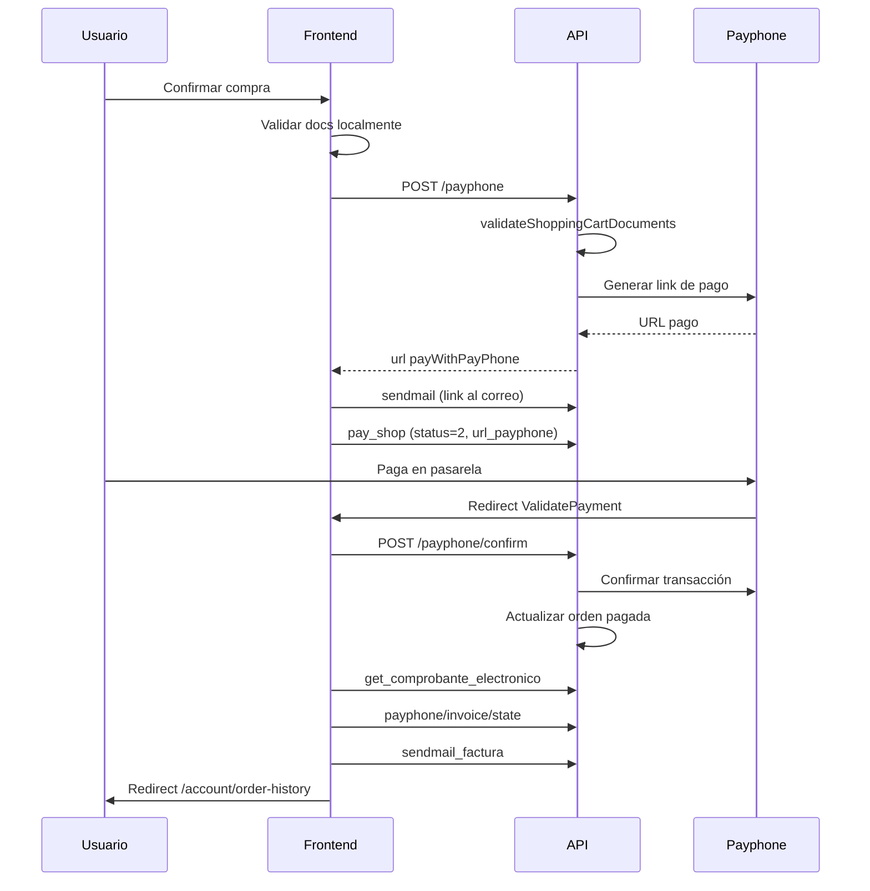

# Flujos de la plataforma All in One

Documentación operativa del marketplace (frontend Vue 2 + API Node/Express).

---

## 1. Autenticación y sesión

### Login
1. Usuario envía email/contraseña → `POST /api/users/login`
2. API devuelve JWT en `access_token` + datos de usuario
3. Frontend guarda en `localStorage`: `id_users`, `access_token`, `id_rol`, etc.
4. Se cargan favoritos (`fetchWishlist`)
5. Redirección a `redirect` query param o `/mainPage`

### Sesión ya iniciada
Si el usuario autenticado intenta abrir `/client/login` o `/client/register`, el router lo redirige automáticamente a:
- la ruta indicada en `?redirect=...` (si no es otra página de auth), o
- `/admin-panel/reports` si `id_rol = 1`, o
- `/mainPage` en cualquier otro caso.

El footer y el menú de cuenta también ocultan «Iniciar sesión» cuando hay sesión activa.

### Protección de rutas (frontend)
Rutas con `meta.requiresAuth: true`:
- `/cart`
- `/favorites`
- `/account/*`
- `/payment/ValidatePayment`

Si no hay sesión → redirect a `/client/login?redirect=...`

### Protección API
Middleware `verifyToken` + `assertSelfUser` en:
- Carrito (`/api/shoppingcar/*` sensibles)
- Favoritos (`/api/favorites/*`)
- Historial (`/api/order_history/*`)

Header: `authorization: <JWT>`

El interceptor en `src/api/index.js` adjunta el token en cada request.

---

## 2. Catálogo y productos

1. Home carga categorías generales desde API
2. Menú **Categorías** se construye dinámicamente (`loadMenus` en Vuex)
3. Catálogo: `/products` con paginación y filtros en URL:
   - `searchBy`, `generalCategoryId`
   - `minPrice`, `maxPrice`
   - `cityId` (productos sin restricción o con esa ciudad en `allowed_cities`)
   - `sortBy`: `name_asc`, `name_desc`, `price_asc`, `price_desc`
   - `page`, `limit` (12 / 24 / 48)
4. Ciudades del filtro: `GET /api/cities/catalog`
5. Detalle: `/products/:id`
   - Galería, cantidad, ciudad (si aplica)
   - Agregar al carrito / favoritos

---

## 3. Favoritos

| Acción | Endpoint | Vuex |
|--------|----------|------|
| Listar | `GET /api/favorites/:id_user` | `fetchWishlist` |
| Agregar | `POST /api/favorites/add` | `addItemToWishlist` |
| Quitar | `POST /api/favorites/remove` | `onDeleteProductFromWishlist` |

- Dropdown en header (`Wishlist.vue`)
- Página completa: `/favorites`
- Corazón en catálogo y detalle de producto

### Migración BD (producción legacy)
```bash
npm run migrate:baseline    # una vez
npm run migrate:favorites   # crear user_favorites
pm2 restart api
```

---

## 4. Carrito de compras

### Agregar producto
1. Usuario autenticado → `addProductToCart` (Vuex action)
2. Si no hay carrito activo → `POST /api/shoppingcar/create_shopp`
3. Detalle → `POST /api/shoppingcar/create_shoppDetails`
4. Vuex actualiza estado local

### Cargar carrito (`/cart`)
1. `GET /api/shoppingcar/get_shop/:id_user`
2. `GET /api/shoppingcar/get_shopDetails/:id_shopping_car`
3. Por cada línea con docs requeridos → `GET /api/product_documents/cart-detail/:id_details`
4. Documentos subidos se rehidratan en `uploadedDocuments`

### Cambiar cantidad
- Debounce 500ms → `updateCartItemQuantity` action
- `POST /api/shoppingcar/create_shoppDetails` con `id_details > 0`
- Recalcula subtotal, IVA y total en backend

### Eliminar producto
- `POST /api/shoppingcar/delete_shoppDetails` (soft delete status=2)

### Documentos obligatorios
1. Modal `CartDocumentsModal.vue`
2. Upload → `POST /api/product_documents/upload-file`
3. Validación cliente antes de confirmar
4. **Validación servidor** antes de Payphone (`cartValidation.js`)

### Cupones promocionales
1. Usuario ingresa código en el resumen del carrito (`CartCoupon.vue`)
2. `POST /api/coupons/apply` con `{ code, id_shopping_car }`
3. Descuento persistido en `shopping_car.coupon_code` / `coupon_discount`
4. Total y Payphone usan subtotal − cupón + IVA
5. Quitar cupón → `DELETE /api/coupons/remove/:id_shopping_car`

**Admin cupones** (`/admin-panel/coupons`, requiere `id_rol = 1`):
| Acción | Endpoint |
|--------|----------|
| Listar | `GET /api/coupons/admin/list` |
| Crear | `POST /api/coupons/admin` |
| Editar / activar | `PUT /api/coupons/admin/:id` |

**Cupones demo** (tras `npm run migrate:coupons`):
| Código | Beneficio |
|--------|-----------|
| `ALLINONE10` | 10% de descuento |
| `BIENVENIDO25` | $25 off en compras ≥ $100 |

---

## 5. Checkout y pago Payphone



### Variables de entorno (API)
| Variable | Uso |
|----------|-----|
| `PAYURLBTN` | URL API Payphone |
| `PAYTOKENBTN` | Token Payphone |
| `PAYURLBTNCONFIRM` | Confirmación pago |
| `PAYPHONE_RESPONSE_URL` | Callback frontend (opcional) |
| `FRONTEND_URL` | Base URL sitio |
| `URLAPIFELECTRONICA` | Factura electrónica |
| `JWT_SECRET_KEY` | Tokens |

---

## 6. Validación de pago (`/payment/ValidatePayment`)

Estados UI:
1. **Verificando** — spinner + pasos
2. **Confirmado** — generando factura
3. **Error** — mensaje + reintentar / ir a pedidos

Query params de Payphone: `?id=...&clientTransactionId=...`

---

## 7. Historial de pedidos

- `GET /api/order_history/get_order_history/:id_user?page=&limit=`
- **Cancelar** orden pendiente → `GET delete_order_history/...` (status=4)
- **Reprocesar factura** → `POST reprocess_invoice/:id_shopping_car/:id_user`

---

## 8. Despliegue

### API
```bash
cd all-in-one-api
npm install
npm run migrate:baseline   # BD legacy, una vez
npm run migrate:favorites
npm start
```

### Frontend
```bash
cd allinone
npm install
npm run serve    # dev
npm run build    # producción
```

---

## 9. Panel admin

### Permiso requerido
| Capa | Criterio |
|------|----------|
| Frontend | `localStorage.id_rol === '1'` (`isAdminUser()` en `src/helpers/auth.js`) |
| API | `assertAdmin` — el JWT debe incluir `id_rol: 1` |

En base de datos, el usuario debe tener **`id_rol = 1`** (administrador) en la tabla `user_rol`, vinculado a una empresa en `company_users`.

Los clientes del marketplace usan **`id_rol = 2`** (`CLIENT_ROL`) y el login normal (`POST /api/users/login`) solo admite ese rol.

### Cómo acceder
1. **URL directa:** `https://<tu-dominio>/admin-panel` (redirige a `/admin-panel/reports`).
2. **Tras iniciar sesión como admin:** menú **Cuenta → Administración** (visible solo si `id_rol = 1`).
3. **Login admin (API):** `POST /api/users/loginAdmin` con `{ email, password, company_id }` — devuelve JWT con el objeto `user` anidado (incluye `id_rol: 1`). Hoy no hay pantalla dedicada en el frontend; el panel asume que `id_rol` quedó guardado en `localStorage`.

Si un usuario sin rol admin abre `/admin-panel`, se redirige a `/client/login?redirect=...&admin=1`.

### Secciones disponibles
| Ruta | Función |
|------|---------|
| `/admin-panel/reports` | Reportes |
| `/admin-panel/products` | Catálogo (CRUD) |
| `/admin-panel/documents` | Revisión de documentos de carrito |
| `/admin-panel/coupons` | Cupones promocionales |
| `/admin-panel/invoices` | Facturas |

| Acción | Endpoint |
|--------|----------|
| Listar documentos | `GET /api/product_documents/admin/review?status=pending\|verified\|all&page=&limit=` |
| Aprobar / rechazar | `PUT /api/product_documents/:document_id/verify` body `{ verified, notes }` |
| Cupones CRUD | `GET/POST/PUT /api/coupons/admin/*` |
| Listar facturas (admin) | `GET /api/admin/invoices?status=all\|pending\|invoiced&search=&page=&limit=` |
| Reprocesar factura | `POST /api/admin/invoices/:id_shopping_car/reprocess` |
| Estadísticas panel | `GET /api/admin/dashboard/stats` |

---

## 10. Rate limiting (API)

- Login: 30 intentos / 15 min por IP
- Payphone: 10 intentos / 5 min por IP

---

## 11. Pendientes conocidos (backlog)

### Completado recientemente
- Facturas admin con API real (`GET /api/admin/invoices`, reprocesar factura)
- Selectores de fecha `valid_from` / `valid_until` en admin cupones
- E2E admin: reportes, cupones, documentos, facturas, product-add (mocks)
- Login admin (`/client/admin-login`) + script `promote:admin`
- Product-edit rediseñado + upload de imágenes de producto
- Reportes admin con datos reales (`GET /api/admin/dashboard/stats`)
- Colaboración y editar perfil admin conectados a API
- Validación de cupón en servidor al generar link Payphone
- Búsqueda unificada: rutas legacy Algolia redirigen a `/products`
- Incrementar `used_count` del cupón al confirmar pago Payphone
- E2E flujo pago completo (carrito → historial y ValidatePayment → historial)

### Alta prioridad
- **Desplegar en producción:** `npm run migrate:coupons` + `pm2 restart api` + build frontend

### Media prioridad
- E2E admin ampliado (editar producto, colaboración)
- Avatar admin (upload)
- Notificaciones toast unificadas (snotify vs inline)
- Recuperación de contraseña end-to-end verificada

### Baja prioridad / pulido
- Link «Administración» también en topbar del header
- Avatar admin (upload)
- Internacionalización (i18n) de textos hardcodeados
- Optimización de assets pesados en build (imágenes login/register)
